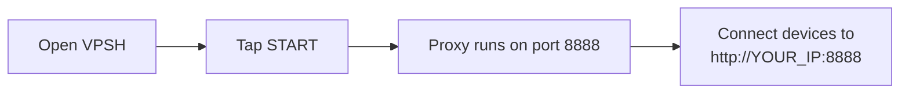
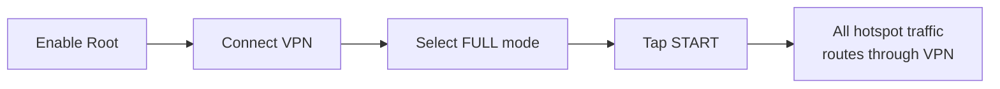
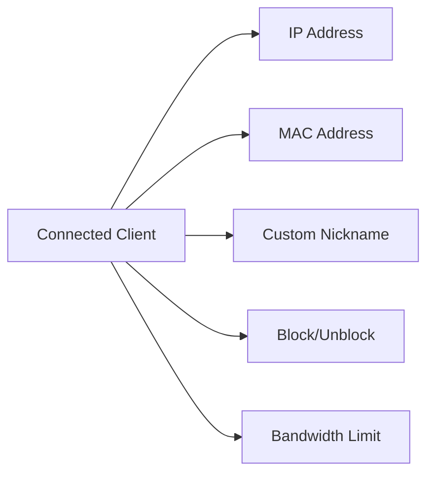
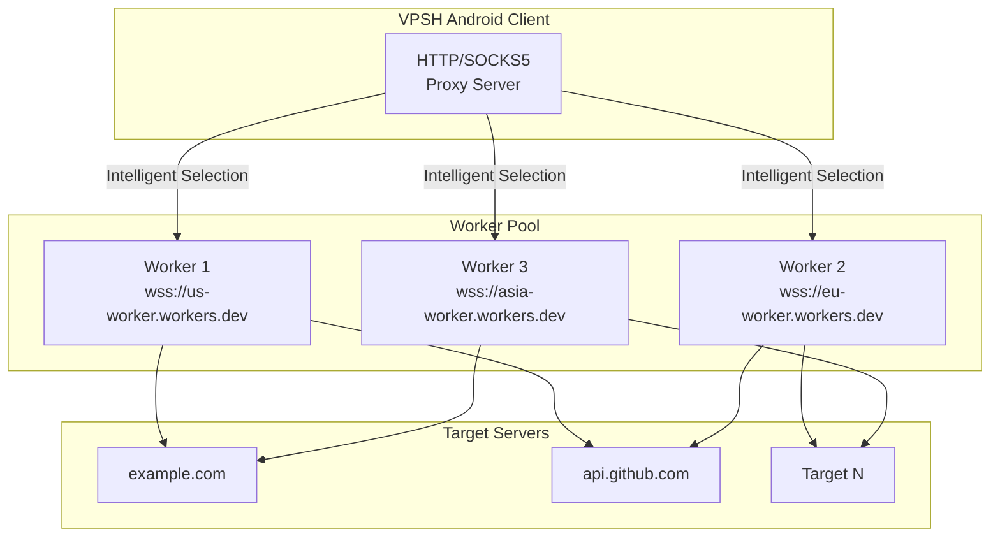
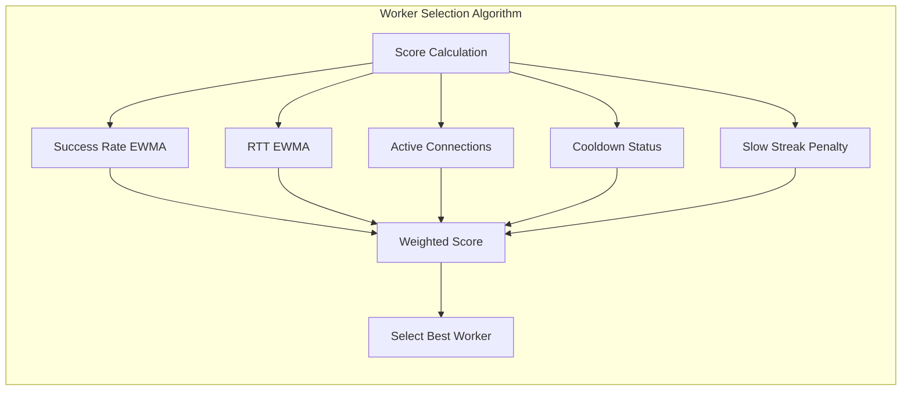

# 🦇 VPSH - VPN Proxy Share Hotspot

<p align="center">
  <a href="README.md">English</a> | 
  <a href="readmefa.md">فارسی</a> | 
</p>

**Version 3.1.0**

> **VPSH** stands for **VPN Proxy Share Hotspot** – your all-in-one solution for sharing internet connectivity from your Android device.

<p align="center">
  
</p>

---

<div align="center">

[](https://www.android.com/)
[](https://kotlinlang.org/)
[](LICENSE)
[](https://github.com/batmanpriv/VPSH)

**Turn your Android device into a powerful network sharing hub**

</div>

---

## 📖 Overview

**VPSH (VPN Proxy Share Hotspot)** is an Android application that transforms your device into a versatile network gateway. Whether you need to share a VPN connection, create a secure proxy server, or build a distributed proxy network with Cloudflare Workers, VPSH has you covered.

**Key capabilities:**
- 🔄 Share internet connection with other devices
- 🔒 Secure HTTP & SOCKS5 proxy server
- 🌐 Full VPN NAT routing (root required)
- 🚀 Distributed proxy via BatProxy
- 📊 Real-time client monitoring & management
- ⚡ Bandwidth limiting per client

---

## ✨ Features at a Glance

<table>
<tr>
<td width="50%">

### 🎯 Proxy Mode
- **No root required**
- HTTP proxy (default: 8888)
- Optional SOCKS5 (default: 1080)
- Username/password authentication
- Upstream proxy chaining
- Kill switch protection
- Client blocking & bandwidth limits

</td>
<td width="50%">

### 🔒 Full Mode
- **Root required**
- Full VPN NAT routing
- IPv6 leak protection
- Per-client bandwidth limiting
- Auto-restart on failure
- Health monitoring
- Shares ANY VPN connection

</td>
</tr>
<tr>
<td colspan="2">

### 🦇 BatProxy
- **Distributed proxy system**
- Cloudflare Workers integration
- Automatic failover
- Smart worker selection
- Real-time health monitoring
- Circuit breaker pattern
- DNS-over-proxy support

</td>
</tr>
</table>

---

## 📋 Table of Contents

<details>
<summary>Click to expand</summary>

1. [Overview](#-overview)
2. [Features at a Glance](#-features-at-a-glance)
3. [Installation](#-installation)
4. [Quick Start Guide](#-quick-start-guide)
5. [Modes of Operation](#-modes-of-operation)
   - [Proxy Mode](#proxy-mode)
   - [Full Mode (VPN NAT)](#full-mode-vpn-nat)
6. [Main Dashboard](#-main-dashboard)
   - [Status & Controls](#status--controls)
   - [Client Management](#client-management)
   - [QR Code Sharing](#qr-code-sharing)
   - [Tethering Support](#tethering-support)
7. [BatProxy Tab](#-batproxy-tab)
   - [What is BatProxy?](#what-is-batproxy)
   - [Adding Workers](#adding-workers)
   - [Worker Health & Stats](#worker-health--stats)
   - [DNS Configuration](#dns-configuration)
8. [Settings](#-settings)
9. [Client Setup Guide](#-client-setup-guide)
10. [Troubleshooting](#-troubleshooting)
11. [FAQ](#-faq)

</details>

---

## 📦 Installation

```bash
# 1. Download the APK from the official source
# 2. Enable "Install from unknown sources" in Android settings
# 3. Install the APK
# 4. Grant notification permission when prompted (Android 13+)
```

**Requirements:**
- Android 7.0 (API 24) or higher
- Internet connection
- Root access (optional, for Full Mode only)

---

## 🚀 Quick Start Guide

### Proxy Mode (No Root Required)



1. Open the app
2. Ensure you're connected to the internet (Wi-Fi or mobile data)
3. Tap **START** on the Dashboard
4. The HTTP proxy will start on port **8888**
5. Connect other devices using:
   - Proxy: `http://[your-phone-ip]:8888`
   - SOCKS5 (if enabled): `[your-phone-ip]:1080`

### Full Mode (Requires Root)



1. Enable root access
2. Make sure your VPN is connected
3. On the Dashboard, select **FULL** mode
4. Tap **START**
5. The app will route all hotspot traffic through your VPN

---

## ⚙️ Modes of Operation

### Proxy Mode

<table>
<tr>
<td>

| Property | Value |
|----------|-------|
| **Root required** | ❌ No |
| **How it works** | Runs HTTP/SOCKS5 proxy server |
| **Default HTTP port** | 8888 |
| **Default SOCKS5 port** | 1080 |

</td>
<td>

**Features:**
- ✅ HTTP proxy on configurable port
- ✅ Optional SOCKS5 proxy
- ✅ Authentication (username/password)
- ✅ Upstream proxy chaining
- ✅ Kill switch
- ✅ Client blocking & bandwidth limiting

</td>
</tr>
</table>

**Limitation:** Cannot share traffic from system-level VPNs (like Viva) because it cannot intercept traffic already routed to the VPN interface.

---

### Full Mode (VPN NAT)

<table>
<tr>
<td>

| Property | Value |
|----------|-------|
| **Root required** | ✅ Yes |
| **How it works** | Routes hotspot traffic through VPN using iptables |
| **Use case** | Sharing VPN connection with multiple devices |

</td>
<td>

**Features:**
- ✅ Full NAT routing through VPN
- ✅ IPv6 leak protection
- ✅ Per-client bandwidth limiting (tc)
- ✅ Health monitoring & auto-restart
- ✅ Shares ANY VPN connection

</td>
</tr>
</table>

**Advantage:** Can share traffic from **any** VPN, including system-level apps like Viva, as it manipulates network routing at the system level.

---

## 📊 Main Dashboard

### Status & Controls

<p align="center">
  
  
  
</p>

- **Status indicator:** Shows current state (Stopped/Starting/Running/Paused/Error)
- **Mode selector:** Switch between PROXY and FULL modes
- **Start/Stop button:** Controls the service
- **Interface info:** Shows detected hotspot and VPN interfaces

### Client Management

When the service is running, connected clients appear in the list with:



**Client controls:**
- ✏️ Tap the **pencil icon** to rename a device
- ⏱️ Tap the **clock icon** to set a bandwidth limit
- 🔒 Tap the **checkmark/block** icon to block or unblock a device

### QR Code Sharing

In Proxy Mode, tap the QR button to display a QR code containing:

```
PROXY http://[username:password@][phone-ip]:[port]
```

Scan this with another device to instantly configure proxy settings.

### Tethering Support

The Dashboard includes a tethering helper section:
- 📶 Detects Wi-Fi, USB, or Bluetooth tethering
- 🔌 USB tether enable button (root required)
- ⚙️ Opens system tethering settings
- 📱 Shows USB cable connection status

---

## 🦇 BatProxy Tab

### What is BatProxy?

BatProxy is an **enterprise-grade, intelligent proxy tunnel** that turns your Android device into a resilient gateway. Instead of relying on a single proxy server, it uses a pool of distributed "workers" – typically deployed as **Cloudflare Workers** – to route your traffic.



The system intelligently:
1. 🎯 **Routes connections** through the healthiest, fastest available worker
2. 📊 **Monitors worker performance** using EWMA (latency, success rate)
3. 🔄 **Automatically fails over** to other workers if one becomes slow
4. 🔁 **Reopens connections** through recovered workers (circuit breaker with exponential backoff)



For a complete technical deep-dive into the architecture, worker selection algorithms, and deployment, visit the official project repository:  
👉 **[BatProxy on GitHub](https://github.com/batmanpriv/BatProxy)**

**How it Works (Briefly):**

1. **Workers** are servers (running on Cloudflare's edge network) that accept WebSocket connections
2. **The Android app (Client)** connects to these workers using a secure, HMAC-authenticated handshake
3. When you or a connected client makes a request, the app selects the optimal worker based on a real-time score
4. Data is relayed through the worker to the target server, with built-in optimizations like **data coalescing** to reduce overhead

This setup provides exceptional reliability, low latency through Cloudflare's global network, and automatic recovery from failures.

### Adding Workers

1. Go to the **BatProxy** tab
2. Tap the **+** button
3. Enter worker URL and password (the same `PASSWD` you set on your Cloudflare Worker)
4. Tap Save

**Worker URL format:** `wss://your-worker-name.workers.dev` (Secure WebSocket)

### Worker Health & Stats

Each worker displays:

| Status | Description |
|--------|-------------|
| 🟢 **Closed** | Healthy and available |
| 🟡 **Half-open** | Recovering from a failure, under probation |
| 🔴 **Open** | Failed, in a cooldown period (excluded from selection) |

**Additional metrics:**
- ⏱️ **Cooldown:** Time remaining before retry
- 📡 **RTT:** Average round-trip time in milliseconds
- 📈 **Score:** Real-time performance score (higher is better)
- 🔗 **Active connections:** Current connections through this worker
- ✅❌ **OK/Fail:** Success and failure counts

### DNS Configuration

- Set custom DNS for DNS-over-proxy resolution
- Default: `1.1.1.1:53`
- DNS queries are sent through the BatProxy tunnel

---

## ⚙️ Settings

### Port Configuration
```
┌─────────────────────────────────────┐
│  HTTP Proxy Port:  [ 8888 ]         │
│  Enable SOCKS5:    [✓]              │
│  SOCKS5 Port:      [ 1080 ]         │
└─────────────────────────────────────┘
```

### Authentication
```
┌─────────────────────────────────────┐
│  Require Auth:     [✓]              │
│  Username:         [ admin ]        │
│  Password:         [ •••••••• ]     │
└─────────────────────────────────────┘
```

### Upstream Proxy Chaining

Chain VPSH through another proxy:

```
┌─────────────────────────────────────────────────────┐
│  Upstream Type:  [ None ▼ ]  [ SOCKS5 ]  [ HTTP ]  │
│  Address:        [ 192.168.1.100 ]                  │
│  Port:           [ 1080 ]                          │
│  Username:       [ optional ]                      │
│  Password:       [ optional ]                      │
└─────────────────────────────────────────────────────┘
```

### Health Monitoring

```
┌─────────────────────────────────────┐
│  Auto Restart:     [✓]              │
│  Health Interval:  [ 25 ] seconds   │
│  Kill Switch:      [✓]              │
└─────────────────────────────────────┘
```

### Full Mode Settings

```
┌─────────────────────────────────────┐
│  Force VPN Only:   [✓]              │
│  Block IPv6 Leak:  [✓]              │
└─────────────────────────────────────┘
```

### Interface Overrides

```
┌─────────────────────────────────────┐
│  Hotspot Interface: [ wlan0 ]       │
│  VPN Interface:     [ tun0 ]        │
└─────────────────────────────────────┘
```

---

## 📋 Logs & Health Checks

The **Logs** tab shows:
- 📝 Service start/stop events
- 🔌 Client connections
- ⚠️ Errors and warnings
- 💚 Health check results

**Health Check button:** Manually triggers a health check and logs the result.

---

## 🔘 Quick Settings Tile

Add VPSH to your Quick Settings panel for one-tap control:

1. Swipe down twice to open Quick Settings
2. Tap the edit/pencil icon
3. Find "VPSH" and drag it to your active tiles
4. Tap the tile to start/stop the service

The tile shows:
- **Active:** Service is running
- **Inactive:** Service is stopped
- **Subtitle:** Current state (Running/Stopped/Paused/Error)

---

## 🔌 Client Setup Guide

### Connecting via HTTP Proxy

**Windows:**
```cmd
netsh winhttp set proxy [phone-ip]:8888
```

**Linux/macOS:**
```bash
export http_proxy=http://[phone-ip]:8888
export https_proxy=http://[phone-ip]:8888
```

**Android (manual):**
```
Settings → Wi-Fi → Tap network → Proxy → Manual
  Proxy hostname: [phone-ip]
  Proxy port: 8888
```

### Connecting via SOCKS5

**Windows:**
```cmd
# Firefox: Settings → Network Settings → SOCKS5
```

**Linux/macOS:**
```bash
export ALL_PROXY=socks5://[phone-ip]:1080
```

### Using the QR Code


### Automated Client Setup Scripts

For quick and easy proxy configuration on your desktop, VPSH provides automated scripts for both Windows and Linux:

| Platform | Script | Description |
|----------|--------|-------------|
| 🪟 **Windows** | [`client-windows.bat`](https://github.com/batmanpriv/VPSH/releases/download/3.1.0/client-windows.bat) | Interactive and command-line proxy manager for Windows |
| 🐧 **Linux** | [`client-linux.sh`](https://github.com/batmanpriv/VPSH/releases/download/3.1.0/client-linux.sh) | Interactive and command-line proxy manager for Linux |

**Windows Usage:**
```cmd
# Interactive mode (double-click or run without arguments)
client-windows.bat

# Command-line mode
client-windows.bat connect 192.168.1.100 8888
client-windows.bat connect 10.0.0.1 1080 myuser mypass
client-windows.bat disconnect
client-windows.bat status
client-windows.bat test
```

**Linux Usage:**
```bash
# Make executable
chmod +x client-linux.sh

# Interactive mode
./client-linux.sh

# Command-line mode
./client-linux.sh connect 192.168.1.100 8888
./client-linux.sh connect 10.0.0.1 1080 myuser mypass
./client-linux.sh disconnect
./client-linux.sh status
./client-linux.sh test
```

**What these scripts do:**
- 🔧 Configure system proxy settings
- 🌐 Set HTTP_PROXY and HTTPS_PROXY environment variables
- ✅ Test connection through the proxy
- 📊 Display current proxy status
- 🔄 One-command disconnect

### Using BatProxy Clients

BatProxy workers are servers that connect to VPSH. To set up a worker:

1. **On the worker server (Cloudflare):**
   - Follow the deployment guide in the [BatProxy repository](https://github.com/batmanpriv/BatProxy)
   - Deploy the `worker.js` code to Cloudflare Workers
   - Set the `PASSWD` environment variable

2. **On your VPSH Android app:**
   - Go to BatProxy tab
   - Add the worker URL (e.g., `wss://your-worker.workers.dev`) and password
   - Start the BatProxy service

3. **Connect clients:**
   - Configure clients to use the VPSH proxy (HTTP/SOCKS5)
   - All traffic will be intelligently routed through healthy workers

---

## 🔧 Troubleshooting

### Common Issues

| Issue | Solution |
|-------|----------|
| ❌ Proxy not starting | Check if port is already in use. Change port in Settings. |
| 🔌 Clients can't connect | Verify you're on the same network. Check firewall settings. |
| 🔒 Full Mode not working | Ensure root is available. Check VPN is active. |
| 🌐 BatProxy workers failing | Verify worker URLs are correct. Check worker password matches. Check internet connection. |
| 🔑 Permission errors | Grant all requested permissions (notifications, VPN). |
| 🔌 USB tether not working | Enable USB tethering in system settings first. |

### Logs
Always check the **Logs** tab for detailed error messages when troubleshooting.

---

## ❓ FAQ

<details>
<summary><b>Do I need root?</b></summary>
Only for Full Mode (VPN NAT routing). Proxy Mode works without root.
</details>

<details>
<summary><b>What's the difference between Proxy and Full mode?</b></summary>
Proxy mode runs a proxy server. Full mode routes all hotspot traffic through the VPN using system-level routing.
</details>

<details>
<summary><b>Why can't I share certain VPNs (like Viva) using Proxy Mode without root?</b></summary>

This is a fundamental limitation of Android's networking architecture:

**1. VPNs Work at the System Level**
- Most VPN apps create a **virtual network interface** (e.g., `tun0`)
- They use Android's `VpnService` API to route **all** device traffic through this interface
- This routing happens at the OS level, **before** any user-space proxy can intercept

**2. Proxy Mode is a User-Space Application**
- VPSH's Proxy Mode runs an HTTP/SOCKS5 proxy server
- It can only accept traffic **explicitly directed to it** by a client app
- It **cannot** see traffic already routed to the VPN interface

**3. The "Chicken and Egg" Problem**
- When you activate a VPN, the system directs all traffic to the VPN interface
- The VPN app encrypts and forwards this traffic to its own server
- A proxy running on the same device is "downstream" of this system-level decision

**The Only Solution: Full Mode (Requires Root)**
- VPSH's **Full Mode** uses `iptables` and routing rules, requiring **root access**
- With root, VPSH can manipulate the system's routing table and firewall to *force* all traffic through the VPN
- This effectively shares the VPN connection with other devices on your hotspot

**In summary:**
- **Without root:** You can only share the internet connection for apps that **choose** to use your proxy
- **With root (Full Mode):** You can share **any** internet connection, including system-level VPNs like Viva

</details>

<details>
<summary><b>How do I find my phone's IP address?</b></summary>
Look in the app's Dashboard under hotspot interface info, or check your Wi-Fi settings.
</details>

<details>
<summary><b>Can I run both HTTP and SOCKS5 simultaneously?</b></summary>
Yes, enable SOCKS5 in Settings and both will run on their respective ports.
</details>

<details>
<summary><b>How do I limit bandwidth per client?</b></summary>
On the Dashboard, tap the clock icon next to any client and set a limit in Kbps.
</details>

<details>
<summary><b>What does BatProxy do?</b></summary>
BatProxy routes traffic through a pool of distributed workers (like Cloudflare Workers), automatically selecting the healthiest one for each request. This provides high reliability and performance.
</details>

<details>
<summary><b>Why are my workers showing "half_open" status?</b></summary>
A worker is in half-open state if it failed but is being retried. It will either recover (closed) or fail completely (open) and enter a cooldown period.
</details>

<details>
<summary><b>How does the health monitor work?</b></summary>
It periodically checks if the service is healthy. If it fails, it attempts to restart up to 5 times before giving up. For BatProxy, it also performs health checks on each worker.
</details>

<details>
<summary><b>Can I use my own BatProxy workers?</b></summary>
Yes! You can deploy the BatProxy worker code (available on <a href="https://github.com/batmanpriv/BatProxy">GitHub</a>) to Cloudflare Workers or any compatible WebSocket server and add the URL to the VPSH app.
</details>

<details>
<summary><b>What are the client scripts for?</b></summary>
The `client-windows.bat` and `client-linux.sh` scripts automatically configure your desktop's proxy settings to connect to VPSH. They support interactive and command-line modes for easy connection management.
</details>
[](https://www.android.com/)

</div>
