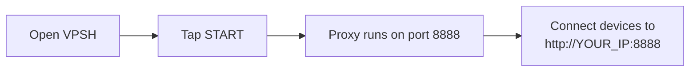
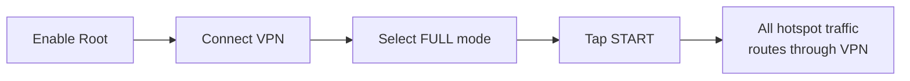
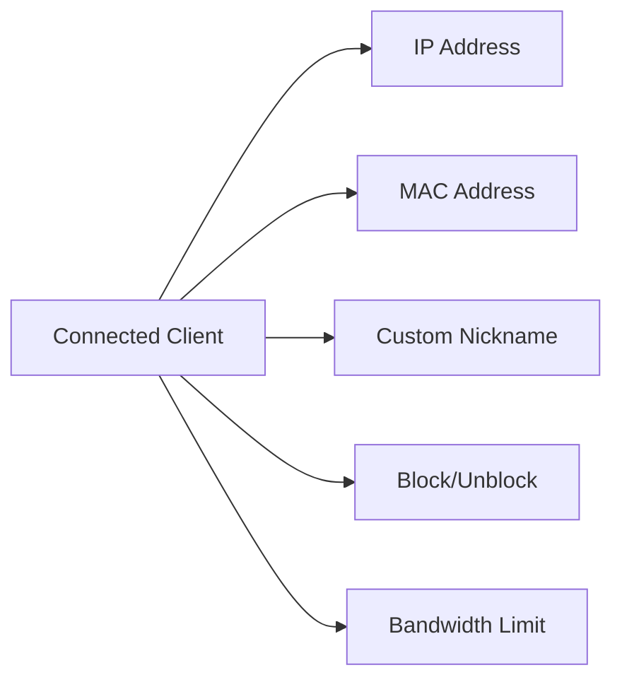
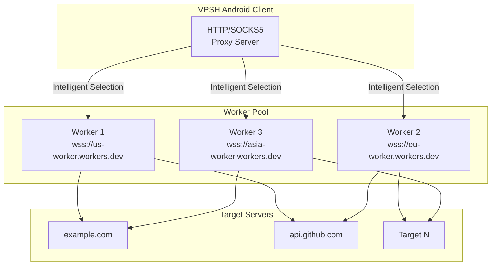

# 🦇 VPSH - VPN Proxy Share Hotspot

<p align="center">
  <a href="README.md">English</a> | 
  <a href="readmefa.md">فارسی</a>
</p>

**Version 3.5.4**

> **VPSH** stands for **VPN Proxy Share Hotspot** – your all-in-one solution for sharing internet connectivity from your Android device.

<p align="center">
  
</p>

---

<div align="center">

[](https://www.android.com/)
[](https://kotlinlang.org/)
[](LICENSE)
[](https://github.com/batmanpriv/VPSH)

**Turn your Android device into a powerful network sharing hub**

</div>

---

## 📥 Downloads

| File | Description | Link |
|------|-------------|------|
| `vpsh-3.5.4.apk` | Android application | [Download APK](https://github.com/batmanpriv/VPSH/releases/download/3.5.4/VPSH.apk) |
| `client-windows.bat` | Windows proxy setup script | [Download BAT](https://github.com/batmanpriv/VPSH/releases/download/3.5.4/client-windows.bat) |
| `client-linux.sh` | Linux proxy setup script | [Download SH](https://github.com/batmanpriv/VPSH/releases/download/3.5.4/client-linux.sh) |

---

## 🆕 What's New in 3.5.4

This release adds a new Advanced Network tab, an in-app update checker, a self-managed access point, and a critical Full Mode fix for rooted phones — on top of everything added since 3.1.0:

- 🌐 **New: Advanced Network tab** – interfaces, IPs, MAC/MTU/state and RX/TX counters, default gateway and DNS (work with or without root); on rooted phones you also get a full iptables rule browser (per table/chain, with delete), a simple form to build and add rules without typing raw syntax, a raw-command box for advanced users, and read/write access to `ip rule` / `ip route`.
- 🔄 **New: Update tab** – checks GitHub for a newer VPSH release from inside the app and opens the release page to download it (install still happens through your browser, not in-app, so Play Protect doesn't flag it as self-updating).
- 📡 **New: Self-managed access point (root, Android 11+)** – instead of turning on the phone's hotspot by hand, VPSH can create its own named/password-protected Wi-Fi access point and share the tunnel through it automatically; falls back to detecting a manually-enabled hotspot if it can't.
- 📱 **New quick-connect tabs** – **Join Wi-Fi** (scan to join the VPSH access point directly, no manual proxy setup) and **Shadowsocks** (scan with any Shadowsocks app for automatic import), alongside the existing Manual/Auto/Guest tabs.
- 🐛 **Critical Full Mode fix (rooted phones):** on Treble/vendor-namespace ROMs (most Snapdragon phones from ~2018 on, including most "modded"/rooted retail phones), disabling hardware offload was silently failing — `stop ipacm` doesn't touch the real daemon on these devices, which now lives at `vendor.ipacm`. Hotspot traffic could bypass the VPN tunnel entirely even though the iptables/routing setup looked correct. VPSH now tries every known service name, verifies the phone's own connectivity before and after, and automatically reverts if disabling offload would break the phone's own data connection.
- 🚫 **Hotspot tab improvements** – bans now re-assert themselves automatically if iptables state gets reset (reboot, another app, etc.), so a banned device stays banned across restarts.
- 📊 **Full Mode traffic accounting** – per-client traffic totals are now tracked in Full Mode too (via a dedicated iptables accounting chain), not just Proxy Mode, so the Dashboard's traffic stat no longer sits at zero when sharing a VPN through NAT.

> **Note:** BatProxy currently tunnels **TCP-only** traffic (web, apps, TLS). UDP-based protocols that rely on QUIC/HTTP3 (some games, some video calls) don't route through it yet — DNS is a special-cased exception and does work.

---

## 📖 Overview

**VPSH (VPN Proxy Share Hotspot)** is an Android application that transforms your device into a versatile network gateway. Whether you need to share a VPN connection, create a secure proxy server, or build a distributed proxy network with Cloudflare Workers, VPSH has you covered.

**Key capabilities:**
- 🔄 Share internet connection with other devices
- 🔒 Secure HTTP & SOCKS5 proxy server, with a one-tap PAC auto-config option for any OS
- 🌐 Full VPN NAT routing (root required)
- 🚀 Distributed proxy via BatProxy, with optional split tunneling
- 📊 Real-time client monitoring & management
- ⚡ Bandwidth limiting per client (works in both Proxy and Full Mode)
- 🎟️ Temporary guest access links
- 🚫 Hard, MAC-level hotspot bans (root)

---

## ✨ Features at a Glance

<table>
<tr>
<td width="50%">

### 🎯 Proxy Mode
- **No root required**
- HTTP proxy (default: 8888)
- Optional SOCKS5 (default: 1080)
- One-tap PAC auto-config for any OS
- Username/password authentication
- Guest links (temporary, quota-limited)
- Upstream proxy chaining (+ saved profiles)
- Kill switch protection
- Client blocking & per-client bandwidth limits

</td>
<td width="50%">

### 🔒 Full Mode
- **Root required**
- Full VPN NAT routing
- IPv6 leak protection
- Per-client bandwidth limiting
- Game Mode (prioritizes real-time traffic)
- Auto-restart on failure
- Health monitoring
- Shares ANY VPN connection

</td>
</tr>
<tr>
<td colspan="2">

### 🦇 BatProxy
- **Distributed proxy system**
- Cloudflare Workers integration
- Automatic failover
- Smart worker selection
- Real-time health monitoring
- Circuit breaker pattern
- DNS-over-proxy support
- Exit-country / region detection
- Split tunneling (choose which apps use the tunnel)
- TCP-only tunnel (see note above)

</td>
</tr>
<tr>
<td colspan="2">

### 🚫 Hotspot Tab (Root)
- Bans devices by MAC address, right at the hotspot interface
- Works even if sharing (Proxy/Full) isn't running
- Survives DHCP/IP changes
- Separate ban list, independent of the Dashboard's proxy-level block

</td>
</tr>
</table>

---

## 📋 Table of Contents

<details>
<summary>Click to expand</summary>

1. [What's New in 3.5.4](#-whats-new-in-354)
2. [Overview](#-overview)
3. [Features at a Glance](#-features-at-a-glance)
4. [Installation](#-installation)
5. [Quick Start Guide](#-quick-start-guide)
6. [Modes of Operation](#️-modes-of-operation)
   - [Proxy Mode](#proxy-mode)
   - [Full Mode (VPN NAT)](#full-mode-vpn-nat)
7. [App Tour](#-app-tour)
   - [Dashboard](#dashboard)
   - [Hotspot Tab](#hotspot-tab)
   - [Network Tab](#-network-tab)
   - [BatProxy Tab](#-batproxy-tab)
   - [Settings](#️-settings)
   - [Logs](#-logs)
   - [About](#-about)
   - [Update Tab](#-update-tab)
8. [Quick Settings Tile](#-quick-settings-tile)
9. [Client Setup Guide](#-client-setup-guide)
10. [Troubleshooting](#-troubleshooting)
11. [FAQ](#-faq)

</details>

---

## 📦 Installation

```bash
# 1. Download the APK from the official source
# 2. Enable "Install from unknown sources" in Android settings
# 3. Install the APK
# 4. Grant notification permission when prompted (Android 13+)
```

**Requirements:**
- Android 8.0 (API 26) or higher
- Internet connection
- Root access (optional — required only for Full Mode, the Hotspot ban tab, and Game Mode)

---

## 🚀 Quick Start Guide

### Proxy Mode (No Root Required)



1. Open the app
2. Ensure you're connected to the internet (Wi-Fi or mobile data)
3. Tap **Start sharing** on the Dashboard
4. The HTTP proxy will start on port **8888**
5. Connect other devices any of these ways:
   - Manually: `http://[your-phone-ip]:8888`
   - SOCKS5 (if enabled): `[your-phone-ip]:1080`
   - **Auto (any OS):** tap the QR button → **Auto** tab → point the other device's "automatic proxy configuration URL" setting at the PAC link shown (no manual proxy fields needed)
   - Scan the **Manual** QR code with a phone

### Full Mode (Requires Root)



1. Enable root access
2. Make sure your VPN is connected
3. On the Dashboard, select **Full** mode
4. Tap **Start sharing**
5. The app will route all hotspot traffic through your VPN — connected devices need zero configuration

---

## ⚙️ Modes of Operation

### Proxy Mode

<table>
<tr>
<td>

| Property | Value |
|----------|-------|
| **Root required** | ❌ No |
| **How it works** | Runs HTTP/SOCKS5 proxy server |
| **Default HTTP port** | 8888 |
| **Default SOCKS5 port** | 1080 |

</td>
<td>

**Features:**
- ✅ HTTP proxy on configurable port
- ✅ Optional SOCKS5 proxy
- ✅ One-tap PAC auto-config for any OS
- ✅ Authentication (username/password)
- ✅ Guest links (temporary, quota-limited)
- ✅ Upstream proxy chaining + saved profiles
- ✅ Kill switch (pauses proxy if your VPN drops)
- ✅ Client blocking & **per-client bandwidth limiting**

</td>
</tr>
</table>

**Limitation:** Cannot share traffic from system-level VPNs (like Viva) because it cannot intercept traffic already routed to the VPN interface — only traffic explicitly pointed at the proxy is shared.

---

### Full Mode (VPN NAT)

<table>
<tr>
<td>

| Property | Value |
|----------|-------|
| **Root required** | ✅ Yes |
| **How it works** | Routes hotspot traffic through VPN using iptables |
| **Use case** | Sharing VPN connection with multiple devices, zero client config |

</td>
<td>

**Features:**
- ✅ Full NAT routing through VPN
- ✅ IPv6 leak protection
- ✅ Per-client bandwidth limiting (tc)
- ✅ Game Mode (prioritizes real-time UDP traffic)
- ✅ Health monitoring & auto-restart
- ✅ Shares ANY VPN connection

</td>
</tr>
</table>

**Advantage:** Can share traffic from **any** VPN, including system-level apps like Viva, as it manipulates network routing at the system level. Connected devices don't need any proxy settings — it's fully transparent.

---

## 📱 App Tour

VPSH has eight tabs: **Dashboard**, **Hotspot**, **BatProxy**, **Settings**, **Logs**, **Network**, **About**, and **Update**.

### Dashboard

- **Status indicator:** Stopped / Starting / Running / Paused (kill-switch) / Error
- **Sharing mode selector:** switch between Proxy and Full (Full is greyed out without root)
- **Start sharing / Stop sharing:** controls the foreground service — once running, a persistent notification with its own Stop button lets you turn it off without reopening the app
- **Public IP & exit country:** shown below the status and refreshed every 5 seconds
- **Interface info:** shows the detected hotspot and VPN interfaces
- **Stat chips:** connected clients, traffic, and port

**Client management** — for every connected client:



- ✏️ **Rename** — give a device a friendly nickname
- ⏱️ **Limit speed** — set a max speed in kbit/s (0 = unlimited); works in **both Proxy and Full mode**
- 🔒 **Block/Unblock** — a blocked device is dropped immediately from the sharing proxy. It moves to a separate "Blocked devices" list with an Unblock button, so you can always undo it later — even after the device disconnects

> Blocking here only refuses the *sharing proxy* — the device can still reach the hotspot itself (other devices on it, the phone's own services). For a hard ban that locks a device out of the hotspot entirely, use the **Hotspot** tab instead.

**Quick connect (QR button)** — up to five tabs (some only appear when relevant):

| Tab | What it shows | Best for |
|-----|----------------|----------|
| **Manual** | `PROXY http://[username:password@][phone-ip]:[port]` as a QR code | Devices/apps that let you set a proxy manually |
| **Auto (any OS)** | A PAC URL as a QR code / link | Windows, macOS, Linux — sets the proxy for the whole OS in one step, no per-app config |
| **Join Wi-Fi** | QR code for VPSH's self-managed access point (see [Settings](#️-settings)) | Joining the access point directly — no manual proxy setup needed |
| **Shadowsocks** | QR code with the Shadowsocks server config | Any Shadowsocks app — imports the server automatically |
| **Guest link** | Create/revoke temporary guest credentials | Handing out access without sharing your real password |

**Guest links** — create a link with:
- An expiry time in minutes
- An optional data quota in MB (0 = unlimited)

The link gets its own random username/password. It expires automatically once the TTL passes or the quota is hit — no manual revoke needed, though you can hit **Revoke** any time to cut it off immediately.

### Hotspot Tab

A dedicated tab for the hotspot itself, separate from the sharing proxy — **requires root**.

- Lists every device currently on the hotspot (Wi-Fi, USB, or Bluetooth), detected straight from the system's neighbor table — this works even if Proxy/Full sharing isn't running at all
- **Ban** a device by its MAC address: this drops its traffic at the hotspot network interface itself, so it can't reach anything through the hotspot — not just the sharing proxy. This survives DHCP/IP changes and works the same in Proxy mode, Full mode, or with sharing stopped entirely
- A separate **Banned from hotspot** list with an Unban button, so past bans stay manageable even after the device disconnects
- Without root, you'll see a notice explaining the tab is unavailable and pointing you back to the Dashboard's proxy-level block
- Bans re-assert themselves automatically if the underlying iptables rule gets reset (reboot, another app, etc.)

### 🌐 Network Tab

A read/write view into the device's networking — some of it works without root, the rest needs it.

**Without root:**
- **Interfaces** — every active network interface with its IP address and prefix (basic state/MTU where the OS exposes it)
- **Gateway & DNS** — the current default gateway and DNS servers for the active network

**With root, you additionally get:**
- Richer per-interface detail: MAC address, MTU, link state, and RX/TX byte counters
- **Firewall rules (iptables)** — browse rules per table (`filter` / `nat` / `mangle`) and chain, each with its line number and a delete button
- **Add a rule** — a simple form (chain, action, protocol, source/destination, in/out interface, port) that builds the iptables arguments for you, plus a preview before you apply it
- **Raw command box** — for advanced users who want to type the exact `iptables` or `ip` arguments themselves
- **Routing** — read `ip rule show` / `ip route show`, and apply raw `ip` commands (e.g. custom routes or policy rules)

> ⚠️ This tab lets you edit live firewall/routing state on the device. A mistyped rule can cut off your own connectivity — double check raw commands before applying them.

### 🦇 BatProxy Tab

#### What is BatProxy?

BatProxy is an **enterprise-grade, intelligent proxy tunnel** that turns your Android device into a resilient gateway. Instead of relying on a single proxy server, it uses a pool of distributed "workers" – typically deployed as **Cloudflare Workers** – to route your traffic.



The system intelligently:
1. 🎯 **Routes connections** through the healthiest, fastest available worker
2. 📊 **Monitors worker performance** using EWMA (latency, success rate)
3. 🔄 **Automatically fails over** to other workers if one becomes slow
4. 🔁 **Reopens connections** through recovered workers (circuit breaker with exponential backoff)

For a complete technical deep-dive into the architecture, worker selection algorithms, and deployment, visit the official project repository:  
👉 **[BatProxy on GitHub](https://github.com/batmanpriv/BatProxy)**

> **Important:** BatProxy runs as its own VPN tunnel for **this device**, not through the HTTP/SOCKS5 proxy servers of Proxy/Full mode. It only tunnels TCP traffic (web browsing, apps, TLS). UDP-heavy protocols like some games or QUIC/HTTP3-based video calls won't route through it yet — DNS resolution is specially handled and does work.

#### Adding Workers

1. Go to the **BatProxy** tab
2. Tap **Add worker**
3. Enter the worker URL and password (the same `PASSWD` you set on your Cloudflare Worker)
4. Save

**Worker URL format:** `wss://your-worker-name.workers.dev` (Secure WebSocket)

> Changing the worker list while BatProxy is connected requires a reconnect (Disconnect → Connect) to take effect.

#### Worker Health & Stats

Each worker displays:

| Status | Description |
|--------|-------------|
| 🟢 **Healthy (Closed)** | Healthy and available |
| 🟡 **Recovering (Half-open)** | Recovering from a failure, under probation |
| 🔴 **Cooling down (Open)** | Failed, in a cooldown period (excluded from selection) |

**Additional metrics:** cooldown time remaining, average RTT in ms, real-time performance score, active connections, OK/Fail counts, and — once connected — the exit country/flag the tunnel is actually using.

#### Split Tunneling

Choose which apps on your phone use the BatProxy tunnel:

| Mode | Behavior |
|------|----------|
| **Off** | Everything on the phone uses the tunnel (default) |
| **Exclude selected apps** | The apps you pick bypass the tunnel; everything else uses it |
| **Only selected apps** | Only the apps you pick use the tunnel; everything else goes direct |

Handy for keeping something like a banking app on your normal connection while everything else routes through BatProxy.

#### DNS Configuration

- Set a custom DNS host/port for DNS-over-proxy resolution
- Default: `1.1.1.1:53`
- DNS queries are sent through the BatProxy tunnel

---

## ⚙️ Settings

### Ports
```
┌─────────────────────────────────────┐
│  HTTP Proxy Port:  [ 8888 ]         │
│  Enable SOCKS5:    [✓]              │
│  SOCKS5 Port:      [ 1080 ]         │
│  Auto proxy setup (PAC): [✓]        │
│  PAC server port:  [ 8199 ]         │
└─────────────────────────────────────┘
```

### Authentication
```
┌─────────────────────────────────────┐
│  Require Auth:     [✓]              │
│  Username:         [ admin ]        │
│  Password:         [ •••••••• ]     │
└─────────────────────────────────────┘
```

### Chain Through Another Proxy (Upstream)

Chain VPSH through another proxy — for example, to layer it on top of a VLESS/VMess/Shadowsocks client (turn on "local proxy only" mode in that client and point VPSH at its local SOCKS5/HTTP port).

```
┌─────────────────────────────────────────────────────┐
│  Upstream Type:  [ None ▼ ]  [ SOCKS5 ]  [ HTTP ]   │
│  Address:        [ 127.0.0.1 ]                       │
│  Port:           [ 1080 ]                            │
│  Username:       [ optional ]                        │
│  Password:       [ optional ]                        │
└─────────────────────────────────────────────────────┘
```

**Saved profiles:** save the upstream above under a name (e.g. "Home SOCKS5", "Work HTTP") and switch between saved profiles with one tap instead of retyping host/port/credentials every time.

### Reliability & Health
```
┌─────────────────────────────────────┐
│  Auto-restart on failure: [✓]       │
│  Health check interval:   [ 25 ]s   │
│  Kill switch (proxy mode):[✓]       │
└─────────────────────────────────────┘
```
The kill switch pauses the proxy automatically if the phone's own VPN drops, and resumes it once the VPN is back.

### Full Mode (Root)
```
┌─────────────────────────────────────┐
│  Cut off clients if VPN drops: [✓]  │
│  Block IPv6 leaks:             [✓]  │
│  Game Mode:                    [✓]  │
└─────────────────────────────────────┘
```
Game Mode prioritizes real-time traffic (games, calls, video chats) over bulk downloads on the hotspot, so one device downloading a big file doesn't add lag to another device's game.

### Access Point (Root, Android 11+)
```
┌─────────────────────────────────────────────────────┐
│  Create access point automatically: [✓]              │
│  Network name (SSID):    [ VPSH ]                     │
│  Password (blank = open): [ •••••••• ]                 │
└─────────────────────────────────────────────────────┘
```
Instead of turning on the phone's hotspot by hand, VPSH creates its own named/password-protected Wi-Fi access point and shares the tunnel through it automatically. Needs root and Android 11+ — on older Android or without root, this falls back to detecting a hotspot you turn on manually. A **Create access point** button lets you test AP creation on its own, without starting proxy/full sharing.

### Network Interface Override (Optional)
```
┌─────────────────────────────────────┐
│  Hotspot Interface: [ wlan0 ]       │
│  VPN Interface:     [ tun0 ]        │
└─────────────────────────────────────┘
```

### Other Settings
- **Auto-start after reboot** — off by default; if enabled and the service was running when the phone shut down, it restarts itself automatically once the hotspot/root are available again
- **Language** — System default / English / فارسی, switchable anytime, applies instantly across the whole app

---

## 📋 Logs

The **Logs** tab shows a live feed of:
- 📝 Service start/stop events
- 🔌 Client connections
- ⚠️ Errors and warnings
- 💚 Health check results
- 🔄 Automatic restarts triggered by the health monitor (up to 5 attempts before it gives up)

**Health Check button:** manually triggers a health check and logs the result.

---

## ℹ️ About

An in-app reference tab covering what each tab does, Proxy vs. Full mode at a glance, links to the client setup scripts, and the developer's GitHub/Telegram.

---

## 🔄 Update Tab

Checks [github.com/batmanpriv/VPSH](https://github.com/batmanpriv/VPSH) for a newer release directly from inside the app.

- Shows your current installed version
- **Check for update** — looks up the latest GitHub release and compares it to what's installed
- If a newer version is available, tap **Open download page** to open the GitHub release page in your browser — the APK downloads and installs from there, not inside VPSH (Google Play Protect flags apps that update themselves in-app as suspicious, so this avoids that)

---

## 🔘 Quick Settings Tile

Add VPSH to your Quick Settings panel for one-tap control:

1. Swipe down twice to open Quick Settings
2. Tap the edit/pencil icon
3. Find "VPSH" and drag it to your active tiles
4. Tap the tile to start/stop the service

The tile shows:
- **Active:** Service is running
- **Inactive:** Service is stopped
- **Subtitle:** Current state (Running/Stopped/Paused/Error)

---

## 🔌 Client Setup Guide

### Connecting via HTTP Proxy

**Windows:**
```cmd
netsh winhttp set proxy [phone-ip]:8888
```

**Linux/macOS:**
```bash
export http_proxy=http://[phone-ip]:8888
export https_proxy=http://[phone-ip]:8888
```

**Android (manual):**
```
Settings → Wi-Fi → Tap network → Proxy → Manual
  Proxy hostname: [phone-ip]
  Proxy port: 8888
```

### Connecting via SOCKS5

**Windows (Firefox):** Settings → Network Settings → SOCKS5

**Linux/macOS:**
```bash
export ALL_PROXY=socks5://[phone-ip]:1080
```

### One-Tap Setup for Any OS (PAC)

The easiest option for a desktop/laptop — no manual proxy fields at all:

1. On the Dashboard, tap the QR button, then the **Auto (any OS)** tab
2. On the other device, open network settings and find **"Automatic proxy configuration URL"** (Windows: Settings → Network → Proxy; macOS: Network → Advanced → Proxies → Automatic Proxy Configuration; Linux/ChromeOS: similar wording)
3. Paste in the PAC URL shown in the app (e.g. `http://192.168.43.1:8199/proxy.pac`)
4. Every app on that device now uses the proxy automatically

### Using the QR Code (Manual)


### Using a Guest Link

1. On the Dashboard, tap the QR button → **Guest link** tab
2. Set an expiry time and (optionally) a data cap, then create the link
3. Share the generated username/password with your guest
4. It stops working on its own once the timer or data cap is hit — or tap **Revoke** to cut it off immediately

### Automated Client Setup Scripts

For quick and easy proxy configuration on your desktop, VPSH provides automated scripts for both Windows and Linux:

| Platform | Script | Description |
|----------|--------|-------------|
| 🪟 **Windows** | [`client-windows.bat`](https://github.com/batmanpriv/VPSH/releases/download/3.5.4/client-windows.bat) | Interactive and command-line proxy manager for Windows |
| 🐧 **Linux** | [`client-linux.sh`](https://github.com/batmanpriv/VPSH/releases/download/3.5.4/client-linux.sh) | Interactive and command-line proxy manager for Linux |

**Windows Usage:**
```cmd
# Interactive mode (double-click or run without arguments)
client-windows.bat

# Command-line mode
client-windows.bat connect 192.168.1.100 8888
client-windows.bat connect 10.0.0.1 1080 myuser mypass
client-windows.bat disconnect
client-windows.bat status
client-windows.bat test
```

**Linux Usage:**
```bash
# Make executable
chmod +x client-linux.sh

# Interactive mode
./client-linux.sh

# Command-line mode
./client-linux.sh connect 192.168.1.100 8888
./client-linux.sh connect 10.0.0.1 1080 myuser mypass
./client-linux.sh disconnect
./client-linux.sh status
./client-linux.sh test
```

**What these scripts do:**
- 🔧 Configure system proxy settings
- 🌐 Set HTTP_PROXY and HTTPS_PROXY environment variables
- ✅ Test connection through the proxy
- 📊 Display current proxy status
- 🔄 One-command disconnect

### Using BatProxy Clients

BatProxy workers are servers that connect to VPSH. To set up a worker:

1. **On the worker server (Cloudflare):**
   - Follow the deployment guide in the [BatProxy repository](https://github.com/batmanpriv/BatProxy)
   - Deploy the `worker.js` code to Cloudflare Workers
   - Set the `PASSWD` environment variable

2. **On your VPSH Android app:**
   - Go to the BatProxy tab
   - Add the worker URL (e.g., `wss://your-worker.workers.dev`) and password
   - Tap **Connect**

3. **Optional:** set up split tunneling if you only want specific apps (or everything except specific apps) to use the tunnel

---

## 🔧 Troubleshooting

### Common Issues

| Issue | Solution |
|-------|----------|
| ❌ Proxy not starting | Check if the port is already in use. Change the port in Settings. |
| 🔌 Clients can't connect | Verify you're on the same network. Check firewall settings. |
| 🔒 Full Mode not working | Ensure root is available. Check the VPN is active. |
| 🧾 PAC / auto-setup doesn't apply | Confirm "Auto proxy setup (PAC)" is on in Settings, and that the other OS actually supports "Automatic proxy configuration URL". |
| 🎟️ Guest link stopped working | It expired or hit its data quota — both are intentional. Create a new one. |
| 🚫 Can't ban from the Hotspot tab | This needs root. Without it, use the Dashboard's proxy-level block instead. |
| 🌐 BatProxy workers failing | Verify worker URLs are correct. Check the worker password matches. Check your internet connection. |
| 🔑 Permission errors | Grant all requested permissions (notifications, VPN). |
| 🔌 USB tether not working | Enable USB tethering in system settings first. |
| 🌐 Can't add/delete firewall rules in the Network tab | This needs root. Interfaces, gateway, and DNS still show without it. |
| 🐛 Full Mode traffic isn't going through the VPN on a rooted phone | Update to 3.5.4 or later — earlier versions could fail to disable Qualcomm IPA hardware offload on Treble/vendor ROMs, letting hotspot traffic bypass the tunnel silently. |
| 🔄 Update tab says a newer version exists but nothing downloads | The APK downloads and installs through your browser, not inside VPSH — check your browser's downloads after tapping "Open download page". |

### Logs
Always check the **Logs** tab for detailed error messages when troubleshooting.

---

## ❓ FAQ

<details>
<summary><b>Do I need root?</b></summary>
Only for Full Mode, the Hotspot ban tab, Game Mode, the self-managed access point, and writing firewall/routing rules in the Network tab. Proxy Mode, PAC auto-setup, guest links, BatProxy, and reading interfaces/gateway/DNS in the Network tab all work without root.
</details>

<details>
<summary><b>What can I do in the Network tab without root?</b></summary>
See your active network interfaces with their IP addresses, plus the current default gateway and DNS servers. Reading and writing firewall (iptables) rules and advanced routing (ip rule / ip route) needs root — the app tries a few read-only queries without root first and falls back gracefully if the ROM doesn't allow it.
</details>

<details>
<summary><b>Is it safe to edit iptables/routing rules from the Network tab?</b></summary>
Only if you know what you're adding — a wrong rule (e.g. a DROP on the wrong chain) can cut off your device's own connectivity. Deleted or misapplied rules aren't automatically undone, so double-check raw commands before applying them. The Dashboard's built-in Full Mode setup doesn't depend on anything you do here; this tab is for extra, manual rules on top of it.
</details>

<details>
<summary><b>What's the difference between Proxy and Full mode?</b></summary>
Proxy mode runs a proxy server that other devices connect to (manually, via PAC, or via QR). Full mode routes all hotspot traffic through the VPN transparently using system-level routing — connected devices need zero configuration.
</details>

<details>
<summary><b>Why can't I share certain VPNs (like Viva) using Proxy Mode without root?</b></summary>

This is a fundamental limitation of Android's networking architecture:

**1. VPNs Work at the System Level**
- Most VPN apps create a **virtual network interface** (e.g., `tun0`)
- They use Android's `VpnService` API to route **all** device traffic through this interface
- This routing happens at the OS level, **before** any user-space proxy can intercept

**2. Proxy Mode is a User-Space Application**
- VPSH's Proxy Mode runs an HTTP/SOCKS5 proxy server
- It can only accept traffic **explicitly directed to it** by a client app
- It **cannot** see traffic already routed to the VPN interface

**3. The "Chicken and Egg" Problem**
- When you activate a VPN, the system directs all traffic to the VPN interface
- The VPN app encrypts and forwards this traffic to its own server
- A proxy running on the same device is "downstream" of this system-level decision

**The Only Solution: Full Mode (Requires Root)**
- VPSH's **Full Mode** uses `iptables` and routing rules, requiring **root access**
- With root, VPSH can manipulate the system's routing table and firewall to *force* all traffic through the VPN
- This effectively shares the VPN connection with other devices on your hotspot

**In summary:**
- **Without root:** You can only share the internet connection for apps that **choose** to use your proxy
- **With root (Full Mode):** You can share **any** internet connection, including system-level VPNs like Viva

</details>

<details>
<summary><b>How do I find my phone's IP address?</b></summary>
Look in the app's Dashboard under the interface info, or check your Wi-Fi settings.
</details>

<details>
<summary><b>Can I run both HTTP and SOCKS5 simultaneously?</b></summary>
Yes, enable SOCKS5 in Settings and both will run on their respective ports.
</details>

<details>
<summary><b>How do I limit bandwidth per client?</b></summary>
On the Dashboard, tap the clock icon next to any client and set a limit in kbit/s. This now works in both Proxy and Full mode.
</details>

<details>
<summary><b>What's the difference between blocking a device and banning it from the Hotspot?</b></summary>
Blocking (on the Dashboard) only refuses that device's access to the sharing proxy — it can still join the hotspot and reach other things on it. Banning (on the Hotspot tab, root required) drops the device's traffic at the hotspot interface by MAC address, locking it out of everything, regardless of whether sharing is running.
</details>

<details>
<summary><b>What are guest links for?</b></summary>
They're temporary proxy credentials with their own expiry time and optional data cap, so you can let someone use your connection briefly without handing out your real username/password.
</details>

<details>
<summary><b>What does BatProxy do?</b></summary>
BatProxy routes your device's own traffic through a pool of distributed workers (like Cloudflare Workers), automatically selecting the healthiest one for each request. This provides high reliability and performance, and is a separate way of getting online — not the same as the HTTP/SOCKS5 proxy in Proxy/Full mode.
</details>

<details>
<summary><b>Why are my workers showing "Recovering" status?</b></summary>
A worker is recovering (half-open) if it failed but is being retried. It will either become Healthy again or fail completely and enter a cooldown period.
</details>

<details>
<summary><b>How does the health monitor work?</b></summary>
It periodically checks if the service is healthy. If it fails, it attempts to restart up to 5 times before giving up. For BatProxy, it also performs health checks on each worker.
</details>

<details>
<summary><b>Can I use my own BatProxy workers?</b></summary>
Yes! You can deploy the BatProxy worker code (available on <a href="https://github.com/batmanpriv/BatProxy">GitHub</a>) to Cloudflare Workers or any compatible WebSocket server and add the URL to the VPSH app.
</details>

<details>
<summary><b>What are the client scripts for?</b></summary>
The <code>client-windows.bat</code> and <code>client-linux.sh</code> scripts automatically configure your desktop's proxy settings to connect to VPSH. They support interactive and command-line modes for easy connection management.
</details>

<details>
<summary><b>Can I use VPSH in Persian?</b></summary>
Yes — go to Settings → Language and pick فارسی (or System default to follow your phone's language). The switch applies instantly, no restart needed.
</details>
</div>
